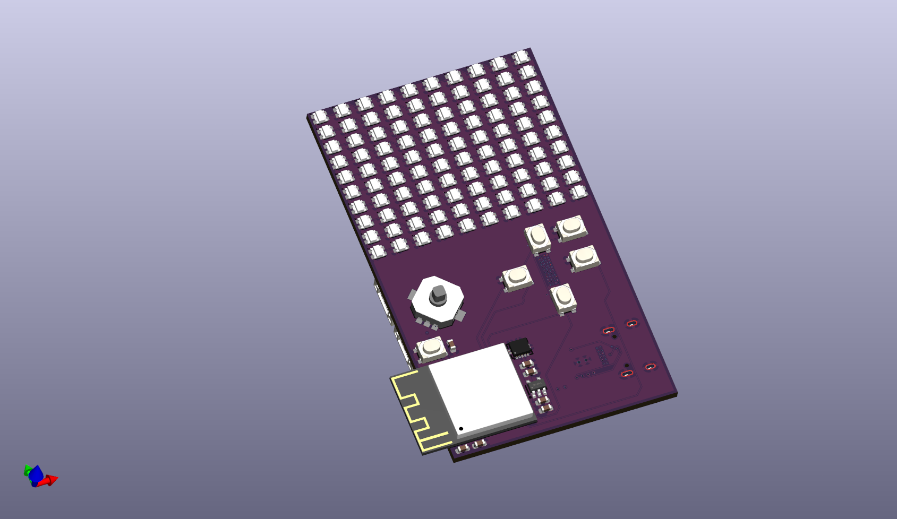
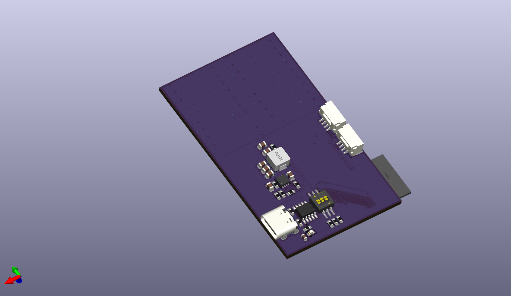

# MateRix Cyberdeck

MateRix is a 10x10 LED Matrix console built around the ESP32-S3. It runs a standalone C++ operating system for embedded games (Tetris, Snake) and connects to a custom PyQt5 desktop application for live telemetry, screen painting, and device configuration over UART.

## Features

* Standalone C++ embedded OS with multitasking state machine
* Playable Tetris and Snake game engines
* Hardware-level Matrix Digital Rain screensaver with idle timeout
* 10x10 WS2812B LED Matrix divided into 4 high-speed hardware quadrants
* Custom Python (PyQt5) desktop studio for live two-way UART communication
* Real-time telemetry broadcasting and remote device configuration
* Open-source hardware and firmware

## Hardware Specifications

* **MCU:** ESP32-S3-Mini
* **Display:** 100x WS2812B LEDs
* **Level Shifter:** 74AHCT125 (3.3V to 5V logic conversion)
* **Inputs:** 4-way D-Pad, 5 Action Buttons (A, B, X, Y, Start)

## Bill of Materials (BoM)

A complete, itemized BOM generated by KiCad can be viewed here: [Production](./production/bom.csv)

## Steps To Reproduce

### Hardware
1. The hardware design files are located in the `hardware/` directory. Send the Gerber files to a manufacturer to produce the PCB.
2. Solder the ESP32-S3-Mini, 74AHCT125, WS2812B LEDs, and tactile buttons.

### Firmware
1. Open the `firmware/` folder in VS Code using the PlatformIO extension.
2. Connect the ESP32-S3 via USB-C and upload the code.

### Software
1. Navigate to the `software/` folder.
2. Run the pre-compiled executable: `software\MateRix_Cyberdeck_Studio.exe`.
3. *(Optional)* To run from source, install dependencies with `pip install pyqt5 pyserial pyautogui` and run `python main.py`.

## Usage of AI

The usage of AI in this project was done with Google Antigravity, which acted as a pair programmer to help debug the C++ firmware, build the Python UI architecture, and verify the hardware pinouts and PCB routing strategies.